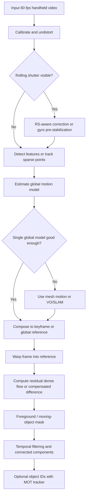

# Video Object Tracking and Global Frame Alignment in 60 FPS Handheld Video

## Executive summary

For 60 fps handheld video, the most effective practical baseline is usually not a heavy end-to-end model. It is a layered pipeline: estimate camera motion between consecutive frames, compose that motion into a keyframe or global reference, warp each frame into that reference, and then detect moving content from the residual motion that remains after compensation. At 60 fps, the inter-frame baseline is usually small enough that sparse Lucas-Kanade tracking, affine estimation, homography fitting, and ECC-style direct alignment often become much more reliable than they are at lower frame rates, especially when the camera shake is modest. The main failure modes are not frame rate, but scene geometry: parallax, dominant moving foregrounds, low texture, exposure changes, and rolling shutter. ?cite?turn39view2?turn39view0?turn27view0?turn26view1?turn26view2?turn28view1?turn28view7?

If the clip is short, the background is mostly distant, and you need a robust engineering solution, a feature-based affine or homography model with RANSAC, followed by residual dense flow or background subtraction on the aligned stream, is still the best first system to build. If the scene has strong depth variation or heavy smartphone wobble, local motion models such as Bundled Camera Paths, SteadyFlow, and MeshFlow are more appropriate than a single global transform. If the clip is long or you need a true world-referenced frame rather than a merely stabilized one, visual odometry or SLAM, especially ORB-SLAM3 or a direct odometry method such as DSO, is a better backbone. If rolling shutter is severe, RS-aware correction should be done before or jointly with stabilization. ?cite?turn29search8?turn29search5?turn29search14?turn9search0?turn8search12?turn28view7?turn28view8?turn28view9?

The strongest recent methods split into three roles rather than one universal solution. First, optical flow models such as RAFT, PWC-Net, GMFlow, and FlowFormer provide high-quality dense motion. Second, online stabilization systems such as Minimum Latency Deep Online Video Stabilization and sensor-fused systems such as SensorFlow learn how to smooth or render stable camera motion. Third, motion-segmentation systems such as RoMo infer what truly moved in the world after accounting for camera motion using optical flow, epipolar geometry, and segmentation priors. In practice, the best 2026-era system for your stated goal is often hybrid: classical geometry for global registration, modern dense flow for residual motion, and a temporal motion mask or tracker on top. ?cite?turn24search5?turn7search4?turn7search5?turn7search2?turn19search8?turn19search11?turn20search8?

## What the problem really is at 60 fps

The core design choice is the motion model. Translation is the cheapest and most stable model, but it assumes negligible rotation, scale change, and perspective effects. Similarity and affine models add rotation, scale, shear, and are often the best default for ordinary handheld footage. Homography is more expressive, but it is fundamentally a perspective transformation between two planes, or a good approximation when pure camera rotation dominates. In real handheld video with depth variation, parallax, and rolling shutter, a single homography will often align much of the frame but still leave structured residual motion in foreground or near-depth regions. OpenCV's stabilization stack exposes this hierarchy directly, from translation through affine to homography. ?cite?turn27view1?turn26view1?turn26view2?turn29search8?

Feature-based and direct methods fail differently. Feature-based methods detect points or descriptors, match them, and robustly fit geometry. They are usually more tolerant of larger displacements and local appearance change, and they give explicit inlier masks for RANSAC-based model fitting. Direct methods optimize image intensities or correlation directly. Lucas-Kanade and its later unifying treatment by Baker and Matthews made image alignment a central primitive for optical flow and tracking, while ECC turned direct alignment into a robust, practical area-based registration tool in OpenCV. Direct methods can be very accurate in small-baseline regimes, but ECC explicitly requires rough initial alignment when displacements or rotations are large, and direct photometric methods generally assume that brightness or some normalized photometric relationship is preserved. ?cite?turn40view0?turn39view0?turn27view0?

Dense and sparse optical flow are complementary, not substitutes. Sparse flow, typically pyramidal Lucas-Kanade, is excellent for camera motion estimation because it is fast and easy to robustify with forward-backward checks and RANSAC. Dense flow, from Farneback and DIS to RAFT and newer transformer-based models, is what you want after global alignment, because it shows where motion remains at the pixel level. The OpenCV documentation explicitly distinguishes sparse Lucas-Kanade from dense Farneback, and DIS is designed as a speed-oriented dense option, while RAFT and its descendants drive state-of-the-art accuracy on Sintel and KITTI. ?cite?turn15search0?turn24search3?turn7search3?turn32view0?turn7search5?turn7search2?

The notion of a "global reference" also needs care. Aligning every frame to the first frame is simple but quickly loses overlap as the camera moves. Aligning to a rolling keyframe is the usual online choice. For offline processing, joint alignment is better than naive frame-to-frame composition because sequential composition accumulates drift. TRGMC explicitly addressed this by replacing purely sequential estimation with joint alignment, while SLAM methods such as ORB-SLAM3 and direct odometry methods such as DSO provide a trajectory in a persistent reference frame that is much more appropriate when the scene is truly 3D or the clip is long. ?cite?turn29search11?turn9search9?turn9search0?turn8search12?

## Method families and literature

The older foundational literature still matters because modern systems keep reusing its primitives. Lucas-Kanade established iterative image registration using image gradients and approximate initial alignment. Baker and Matthews systematized the family of image-alignment algorithms and highlighted the inverse compositional variant for efficiency. ECC supplied a practical direct alignment objective that is still widely used in OpenCV. Farneback and Brox-style variational flow set the template for dense motion estimation. For stabilization, Matsushita's full-frame stabilization with motion inpainting, Grundmann's L1 optimal camera paths, and Bundled Camera Paths established the classical recipe: estimate motion, smooth trajectories, warp frames, and balance stability against distortion and cropping. ?cite?turn40view0?turn39view0?turn27view0?turn24search3?turn24search1?turn13search9?turn13search0?turn29search8?

The last decade pushed each part of the pipeline further. On the global registration side, RGMC improves homography estimation when the foreground dominates, and TRGMC improves temporal consistency by joint alignment to a global coordinate system. On the stabilization side, SteadyFlow, Bundled Paths, and MeshFlow replaced single global transforms with spatially varying motion models to better handle parallax and rolling shutter. On the camera-pose side, DSO and ORB-SLAM3 bring world-referenced motion estimation that is much stronger than 2D alignment for long clips or revisited viewpoints. ?cite?turn28view1?turn29search11?turn29search5?turn29search8?turn29search14?turn8search12?turn9search0?

Optical flow has changed most visibly. PWC-Net showed that pyramids, warping, and cost volumes could produce compact, strong learned flow. RAFT then became a landmark architecture by using all-pairs correlations and recurrent refinement, reaching major gains on KITTI and Sintel. GMFlow and FlowFormer pushed transformer-style global matching and cost-volume reasoning further. For your use case, these models are valuable less as standalone "stabilizers" and more as dense residual-motion estimators after coarse global registration. ?cite?turn24search5?turn24search2?turn32view0?turn7search5?turn7search2?

Moving-object reasoning in dynamic video has also matured. Tokmakov et al. showed that motion patterns can be learned from flow for moving-object segmentation independent of camera motion. RoMo is a strong recent example of a geometry-aware approach, combining optical flow, epipolar cues, and segmentation priors to infer motion masks relative to a static world. That is very close to your target formulation, and it is one of the clearest current pointers if you want to go beyond raw residual-flow thresholding. ?cite?turn20search2?turn20search14?turn20search8?turn20search4?

Rolling shutter needs separate treatment because it breaks the assumption that one frame corresponds to one camera pose. Karpenko et al. showed that gyroscopes can be used for real-time stabilization and rolling-shutter correction in a unified model. More recent learning-based approaches such as AdaRSC with the BS-RSC dataset and JCD with the BS-RSCD dataset address real dynamic scenes with object motion, not just synthetic or static scenes. When RS is visible, trying to force everything through a framewise homography is usually the wrong move. ?cite?turn28view7?turn28view8?turn28view9?

## Comparative assessment of representative methods

The table below mixes reported properties from the papers with comparative synthesis for assumptions, cost, and 60 fps suitability. The "cost" and "fit" columns are therefore analytical judgments, not direct quotations. ?cite?turn27view1?turn29search11?turn32view0?turn19search8?turn20search8?

| Paper | Year | Approach | Key assumptions | Main strengths | Main weaknesses | Relative cost | Suitability for 60 fps handheld video | Available code |
|---|---:|---|---|---|---|---|---|---|
| Lucas-Kanade; Baker-Matthews ?cite?turn40view0?turn39view0? | 1981, 2004 | Sparse direct alignment and tracking | Small inter-frame motion, approximate initialization, photometric consistency | Extremely fast, interpretable, still the best sparse baseline for pairwise alignment | Drifts over time, sparse only, weaker under strong exposure change or large parallax | Low CPU | Excellent as a first-pass camera-motion estimator at 60 fps | OpenCV `calcOpticalFlowPyrLK` ?cite?turn15search0? |
| ECC image alignment ?cite?turn27view0? | 2008 | Direct area-based parametric alignment | Rough initial overlap, one global warp family | Precise for translation, Euclidean, affine, or homography refinement | Can fail when initialization is poor, not ideal for strong local nonrigid effects | Low to moderate CPU | Excellent for refining affine or homography on already-close 60 fps frames | OpenCV `findTransformECC` ?cite?turn27view0? |
| RGMC ?cite?turn28view1? | 2015 | Feature-based homography with foreground suppression | Dominant background still exists, background and foreground motions can be clustered | Strong practical fix when foreground overwhelms naive RANSAC | Still a single homography, so true parallax remains | Low to moderate CPU | Very good offline or batch baseline for handheld clips with moving people or cars | Public MATLAB repo ?cite?turn9search6? |
| TRGMC ?cite?turn29search11?turn9search9? | 2016 | Joint keypoint-based congealing to a global coordinate frame | Enough repeatable background keypoints across the sequence | Much better global consistency than naive frame chain composition | Offline, more complex than pairwise fitting, still 2D global-motion oriented | Moderate to high CPU | Excellent if you want a clip-wide global reference rather than only pairwise stabilization | Public MATLAB repo ?cite?turn9search1? |
| DSO ?cite?turn8search12? | 2018 | Direct sparse visual odometry | Photometric calibration matters, enough semi-dense structure, mostly rigid scene | World-referenced camera motion, good small-baseline tracking | Dynamic objects hurt pose unless masked, more complex than 2D GMC | Moderate CPU, moderate GPU not required | Strong when you need a persistent reference frame and can tolerate VO complexity | Official repo ?cite?turn8search16? |
| ORB-SLAM3 ?cite?turn9search0? | 2020 | Feature-based visual and visual-inertial SLAM | Rich features, mostly static scene, loop closures or revisits help | Robust long-range camera pose, map reuse, IMU support | Overkill for simple clips, dynamic foregrounds can corrupt tracking without masking | Moderate CPU to high depending setup | One of the best choices for long handheld sequences and true global anchoring | Official repo ?cite?turn9search4? |
| MeshFlow ?cite?turn29search14? | 2016 | Spatially smooth sparse mesh motion with one-frame latency | Local motion is smoother than per-pixel flow but not globally rigid | Real online stabilization, better than one homography under parallax | Not a full world-frame estimator, code ecosystem is thinner | Moderate CPU | Very good when single-homography alignment visibly fails but latency must stay low | Project page; public third-party implementation available ?cite?turn35search6? |
| RAFT ?cite?turn32view0? | 2020 | Dense learned optical flow with all-pairs correlations | Enough compute, trained-model generalization is acceptable | Excellent dense residual motion, strong cross-dataset accuracy | Heavier than classical flow, not itself a camera-pose model | High GPU | Excellent as the residual-motion stage after coarse global alignment | Official PyTorch repo ?cite?turn7search0? |
| AdaRSC with BS-RSC ?cite?turn28view8? | 2022 | Learned rolling-shutter correction with adaptive warping | RS distortions are significant and data distribution is similar enough | Strong real-world RS correction, dynamic-scene dataset | Adds a specialized model stage, not needed when RS is mild | Moderate to high GPU | Highly relevant if smartphone RS is visible and corrupting alignment | Official repo and dataset ?cite?turn10search0? |
| Minimum Latency Deep Online Video Stabilization ?cite?turn19search8?turn36search3? | 2023 | Learned camera-path optimization for online stabilization | Short temporal windows carry enough motion context | Strong online stabilization without future-frame lookahead | Mainly solves stabilization, not explicit world-frame motion segmentation | Moderate to high GPU | Good when you want visually stable output in real time, less central for scientific global registration | Official repo and dataset ?cite?turn19search0? |
| RoMo ?cite?turn20search8? | 2025 | Motion segmentation using optical flow, epipolar constraints, and segmentation priors | Camera pose is good enough for epipolar reasoning, scene is not fully dynamic | Very close to the "what moved in the world frame?" problem | Depends on strong upstream pose and flow, heavier than thresholding residual flow | High GPU | Excellent for hard dynamic-scene motion masks after camera-motion estimation | Official repo ?cite?turn20search4? |

A few influential methods that do not need separate rows but should still be on your reading list are Matsushita et al. for full-frame stabilization with motion inpainting, Grundmann et al. for L1 optimal camera paths, Bundled Camera Paths for spatially varying stabilization that directly addresses parallax and rolling shutter, SteadyFlow for spatially smooth optical-flow stabilization, PWC-Net as a compact deep-flow milestone, and SensorFlow for modern image-and-IMU fusion. ?cite?turn13search9?turn13search0?turn29search8?turn29search5?turn24search5?turn19search11?

## Recommended practical pipelines

For your stated goal, I would recommend building one of two pipelines first, and only then escalating to heavier models. The first is a classical geometry-plus-flow pipeline. The second is a SLAM-anchored pipeline for longer or more 3D clips. A separate RS-aware front end is worth adding only when the footage shows row-wise wobble, bent verticals, or per-row motion inconsistency. The flowchart below captures the overall logic. ?cite?turn27view1?turn29search14?turn9search0?turn20search8?turn28view7?turn28view8?

The best engineering baseline for 1080p60 is this. First, undistort the video if intrinsics are known. Second, detect or track sparse points, usually ORB or Shi-Tomasi plus pyramidal Lucas-Kanade. Third, fit translation, similarity, affine, or homography with RANSAC. In most handheld scenes, affine is the strongest default because it is less brittle than homography and more expressive than translation. Fourth, compose transforms to a keyframe reference rather than endlessly to frame zero. Fifth, warp the frame into that reference. Sixth, compute dense residual flow between the warped frame and a reference background estimate or adjacent stabilized frames. Finally, threshold residual motion and enforce temporal persistence so that a one-frame flow glitch does not become a moving-object detection. This exact decomposition is well supported by the classical alignment literature, OpenCV's stabilization and motion APIs, and modern flow papers. ?cite?turn25search0?turn15search0?turn26view1?turn26view2?turn9search3?turn9search7?turn32view0?

For clips with strong 3D motion, a better pipeline is camera-pose first, motion-mask second. Use ORB-SLAM3 when you want a feature-based map and possibly IMU fusion. Use DSO when you prefer a direct method and have good photometric behavior. Then discard dynamic points using epipolar inconsistency, residual flow, or a RoMo-style motion mask, and re-estimate pose if needed with the dynamic regions masked out. Once you have a stable camera trajectory in a global frame, per-object motion becomes "what is inconsistent with that trajectory?" rather than "what differs from a homography?" That distinction matters a lot in indoor scenes, street scenes, and other clips with depth variation. ?cite?turn9search0?turn8search12?turn20search8?

For rolling shutter, the safest rule is simple. If RS is mild, a local mesh warp can often absorb the damage. If RS is obvious, correct it before trusting global alignment. Karpenko et al. showed this clearly for gyro-assisted mobile capture. AdaRSC and JCD show that learning-based correction can now work on real dynamic scenes as well. In other words, if the sensor violates the "single pose per frame" assumption badly enough, better camera-motion estimation does not solve the problem by itself. ?cite?turn28view7?turn28view8?turn28view9?

As engineering starting values, not universal truths, the following usually work well at 1080p60. Track roughly 1,000 to 3,000 well-distributed points. Use pyramidal LK with a window around 21x21 or 31x31 and 3 to 4 pyramid levels. Reject points with forward-backward error above about 0.5 to 1.0 pixels. Start with affine fitting and a RANSAC reprojection threshold around 1 to 3 pixels; OpenCV's geometric estimators default to 3 pixels and confidence near 0.99. Promote to homography only when the inlier structure supports perspective motion. Refresh the keyframe every 15 to 30 frames, or whenever overlap visibly degrades. On the aligned stream, MOG2 with history around 200 to 500 and a slow learning rate around 0.001 to 0.01 is a sensible baseline. For residual dense flow, a motion threshold near 1 to 2 pixels with persistence over 3 to 5 frames is a good initial detector for true movers at 60 fps. These values are best treated as first-pass defaults to tune around, not as theory. ?cite?turn15search0?turn26view1?turn26view2?turn14search1?turn27view0?turn27view1?

Robustness improves a lot if you do five small things consistently. Use spatial bucketing so feature tracks cover the frame instead of clustering on one object. Mask image borders and warped undefined regions before refitting motion. Maintain a separate "don't trust for camera motion" mask from residual flow or semantics so walkers and cars do not dominate RANSAC. Re-anchor often, either with keyframes or with global optimization, to avoid transform drift. If instance identities matter after motion detection, do not reinvent MOT. Pass connected components or detections into SORT, Deep SORT, or ByteTrack. ?cite?turn28view1?turn29search11?turn34search5?turn34search4?turn34search3?turn34search0?

OpenCV already gives you most of the classical building blocks: `findTransformECC`, `calcOpticalFlowPyrLK`, `calcOpticalFlowFarneback`, `DISOpticalFlow`, `estimateAffine2D`, `estimateAffinePartial2D`, `findHomography`, the `videostab` motion estimators and motion filters, and `BackgroundSubtractorMOG2`. For research-grade dense flow and motion segmentation, the most active public code is mostly in PyTorch, especially RAFT, GMFlow, FlowFormer, NNDVS, BSRSC, RoMo, ByteTrack, and ORB-SLAM3 wrappers. ?cite?turn27view0?turn15search0?turn7search3?turn26view1?turn26view2?turn9search7?turn14search1?turn7search0?turn7search1?turn7search6?turn19search0?turn10search0?turn20search4?turn34search0?

## Evaluation and benchmarks

Evaluation should be split by task, because no single metric answers your problem. For frame alignment and global motion estimation, the right diagnostics are inlier ratio, reprojection RMSE, ECC score, and long-range drift. If you have trajectory ground truth, use visual-odometry metrics such as absolute trajectory error and relative pose error. For dense motion, use endpoint error and angular error, and on KITTI report outlier rates such as Fl-all. For motion masks, use region IoU or Jaccard, contour quality, and temporal stability. For stabilization, use cropping ratio, distortion, and stability score, which most recent stabilization papers still report. ?cite?turn27view0?turn30view4?turn32view1?turn31view0?turn35search0?turn35search11?

DAVIS remains the cleanest benchmark for video object segmentation because it provides dense annotations and evaluates region similarity \(J\), contour accuracy \(F\), and temporal stability \(T\). In the DAVIS paper, \(J\) is defined as mask intersection-over-union, \(F\) as a contour-based F-measure, and \(T\) as a contour deformation stability measure. KITTI Flow 2015 is essential when you care about moving camera plus moving objects, because it explicitly contains dynamic scenes and evaluates bad-pixel and outlier rates. Middlebury is still valuable for endpoint and angular error reporting on classical flow, while Sintel is useful for long-range motion, motion blur, atmospheric effects, and difficult nonrigid flow. ?cite?turn31view0?turn28view12?turn32view1?turn30view4?turn22search0?turn22search4?

For motion segmentation specifically, FBMS-59 is still a classic choice, and CDnet 2014 is worth using when you want change-detection style measures and hard categories such as PTZ. For world-frame camera estimation, TUM VI and EuRoC are standard references because they provide synchronized image and IMU data with trajectory ground truth. For rolling shutter, BS-RSC and BS-RSCD are the most relevant recent real-world datasets. For learning stabilization, DeepStab and newer motion datasets such as MotionStab are the main public options used by online stabilization work. ?cite?turn6search0?turn6search10?turn30view2?turn28view13?turn28view14?turn28view8?turn28view9?turn23search19?turn19search12?turn36search6?

A compact benchmark menu is below.

| Goal | Benchmark or dataset | Why it matters |
|---|---|---|
| Dense optical flow | Middlebury ?cite?turn30view4? | Classic EPE and angular-error reporting for dense flow |
| Dense flow under difficult nonrigid motion | MPI Sintel ?cite?turn22search0?turn22search4? | Long motions, blur, atmospheric effects, difficult synthetic realism |
| Dense flow with moving camera and moving objects | KITTI Flow 2015 ?cite?turn32view1? | Dynamic road scenes, bad-pixel and outlier metrics |
| Motion segmentation and VOS | DAVIS 2016/2017 ?cite?turn28view12?turn31view0? | Strong mask metrics \(J, F, T\) and dense annotations |
| Motion segmentation | FBMS-59 ?cite?turn6search0? | Classic moving-object segmentation benchmark |
| Change detection under hard camera behavior | CDnet 2014, especially PTZ ?cite?turn6search10?turn30view2? | Useful for compensated-stream foreground extraction stress tests |
| Camera trajectory and global reference | TUM VI ?cite?turn22search5?turn28view13? | Handheld visual-inertial benchmark with photometric calibration |
| Visual-inertial odometry | EuRoC MAV ?cite?turn28view14? | Standard stereo+IMU benchmark with accurate ground truth |
| Rolling-shutter correction | BS-RSC and BS-RSCD ?cite?turn28view8?turn28view9? | Real RS distortion in dynamic scenes |
| Stabilization training and comparison | DeepStab, MotionStab ?cite?turn23search19?turn19search12?turn36search6? | Public paired shaky/stable data used by online stabilization work |

The most defensible evaluation protocol for your problem is therefore mixed. Measure pairwise alignment quality and long-range drift. Measure dense-flow residual error on moving-camera datasets. Measure motion-mask quality on DAVIS or FBMS after your compensation stage. If you render stabilized video, also report cropping ratio, distortion, and stability score. That combination lets you tell whether your system is failing because the camera alignment is wrong, because the residual-motion stage is weak, or because the rendering stage is over-smoothing or warping geometry. ?cite?turn31view0?turn32view1?turn35search0?turn35search11?
